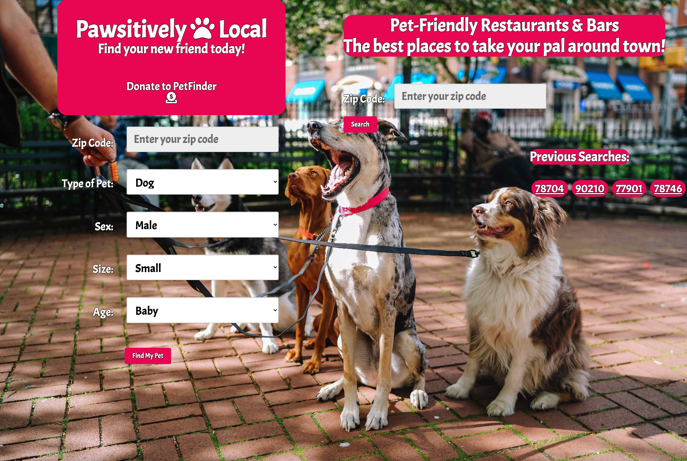

# Animal-App
An application that allows users to search for adoptable pets and suggest pet-friendly locations.

## Description

Pawsitively Local is a web application designed to help users locate dogs and cats available for adoption within their chosen zip code. Additionally, the user has the ability to search for pet-friendly restaurants and bars within their desired zip code to take their pet. The data provided within this application is sourced from PetFinder and Yelp. Pure CSS and JQuery are both used in this application.

[Deployed App](https://chadkraus87.github.io/Animal-App)

## Installation

No installation necessary for this application. If you would like to use this code, you may clone down the repo.

## Usage

Upong navigating to the Pawsitively Local landing page, the user is greeted with an easy-to-use interface with a photo of dogs on a leash and pops of color to compliment. From the left side of the website, the user is presented with a search entry box to type in a zip code of their choice and two dropdown menus. From the two dropdown options, the user has the choice of filtering results based on the type of pet (cat or dog) and the sex of the pet (male or female). After the user has made their selection, clicking the "Find My Pet" button will return possible pet matches. The data provided for available pets is provided by PetFinder and returns the pet's name, age, breed, alteration status, and a photo of the pet as well. Both the photos and the data returned are live links that take the user directly to the pet's adoption page on the PetFinder website.

From the right side of the website, the user has the ability to search for pet-friendly restaurants and bars within a 5-mile radius of their chosen zip code. After typing in the zip code of their choice, the user is presented with a list of 10 results that match the specified criteria. The data returned shows the restaurant's name, star rating, number of reviews, and physical street address. The user can then click each link and they will be redirected to the restaurant/bar's Yelp page.

## Credits

[PetFinder API](https://www.petfinder.com/developers/v2/docs/)

[Day.JS](https://day.js.org/)

[SpectralOps - The Complete Guide to the Yelp API](https://spectralops.io/blog/yelp-api-guide/)

[Yelp API Reference](https://docs.developer.yelp.com/reference/v3_business_search)

[Web API - Response](https://developer.mozilla.org/en-US/docs/Web/API/Response)

[Web API - Append Method](https://developer.mozilla.org/en-US/docs/Web/API/Element/append)

[JQuery Ajax](https://api.jquery.com/jquery.ajax/)

[HTTP Methods - GET](https://developer.mozilla.org/en-US/docs/Web/HTTP/Methods/GET)

[Using Fetch](https://developer.mozilla.org/en-US/docs/Web/API/Fetch_API/Using_Fetch)

[jQuery API](https://api.jquery.com/)

[Template Literals](https://developer.mozilla.org/en-US/docs/Web/JavaScript/Reference/Template_literals)

[CORS Anywhere](https://code4developers.com/cors-anywhere/)

[Pure CSS](https://purecss.io/start/)

[Unsplash](https://unsplash.com/photos/aI3EBLvcyu4)

## License

MIT License

A short and simple permissive license with conditions only requiring preservation of copyright and license notices. Licensed works, modifications, and larger works may be distributed under different terms and without source code.